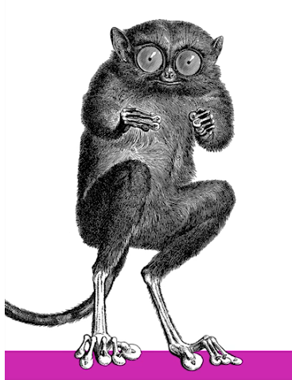

# Vim Shortkeys

## Table of Contents
## Learning The Basic

- [Learn to move](#learn-to-move)
- [First set the ruler](#first-set-the-ruler)
- [Fix Your Deletion](#fix-your-deletion)
- [Control Your Insertions](#control-your-insertions)
---
## Learn to move
Most vi users know the basic cursor motions of Normal mode:
```
      k
    h   l
      j
```
Or four arrows
The are also higher-level motion commands and operators
For words, lines, and other "text-objects"

## Word motions
 * To move forward to the start of the next word: `w`
 * To move backwards to the start of the previous word: `b`
 * To move forward to the <ins>end</ins> of the next word: `e`
 * To move backforward to the <ins>end</ins> of the previous word: `ge`

"Words" are considered anything that is delimited by non-identifier characters. All the motions have uppercase versions that use <ins>whitespace</ins> as the word delimiter instead.

## Line and paragraph motions
 * To move to the start of the current line: `0`
 * To move to the start of the first word of the current line: `^`
 * To move to the end of the current line: `$`
 * To move to the start of the next line: `<CR>`
 * To move to the start of the previous line: `-`

 * To move to start of the current paragraph: `{`
 * To move to the end of the current paragraph: `}`

A paragraph is delimited by empty lines (i.e. <ins>not</ins> black lines)

## Miscellaneous motions
 * To move to the top of the buffer: `gg`
 * To move to the end of the buffer: `G`
 * To move line <ins>N</ins>: `<N>G` or `<N>gg`
 * To move to the point <ins>P</ins> percent through the buffer: `<P>%`

## Matching delimiters
 * To move the matching bracket of a {...}, (...), or [...] pair: `%`

By default , Vim only matches {...}, (...), and [...], but you can extend that to whatever pairs you like:
```
set matchpairs+=<:>, <<:>>
```
Even to "pairs" that aren't normally considered pairs:
```
set matchpairs+==:;
```
## Repeated motions
Tedious to have to type `lllll` to move five chars right:
 * instead can type: `5l`
 * likewise, up three lines: `3k`
 * likewise, ahead four paragraphs: `4}`

## First set the ruler
To find out where you are in a file: `<CTRL-G>`
To always know where you are, set the ruler, in yout `.vimrc` file:
```
set ruler
```

##  Fix Your Deletion
For example:
```
:set backspace=start    "Can delete back past start of edit

:set backspace=indent   "Can delete back past autoindenting

:set backspace=eol      "Can delete back to the previous line
```
You may want all three:
```
:set backspace=start,indent,eol
```

## Control Your Insertions
In *Insert* or *Replace* mode, most characters you type simple insert that character, but not all. Many of control characters have special insertion behaviours.

 * `CTRL-y` duplicates what's in the same column on the preceding line
 * `CTRL-e` duplicates what's in the same column on the following line
 * `CTRL-a` inserts again whatever the most-recent inserted text was
 * `CTRL-r=` evaluates expression and inserts the result

 * `CTRL-t` insert a tab at the start of the line
    (without moving the insertion point)
 * `CTRL-d` delete a tab at the start of the line
    (without moving the insertion point)
 * `CTRL-v` insert the next character verbatim
 * `CTRL-w` deletes the word preceding the cursor
 * `CTRL-o` takes you back to Normal mode for one command, which is handy, for example, to clean the rest of the line: `CTRL-oD`


